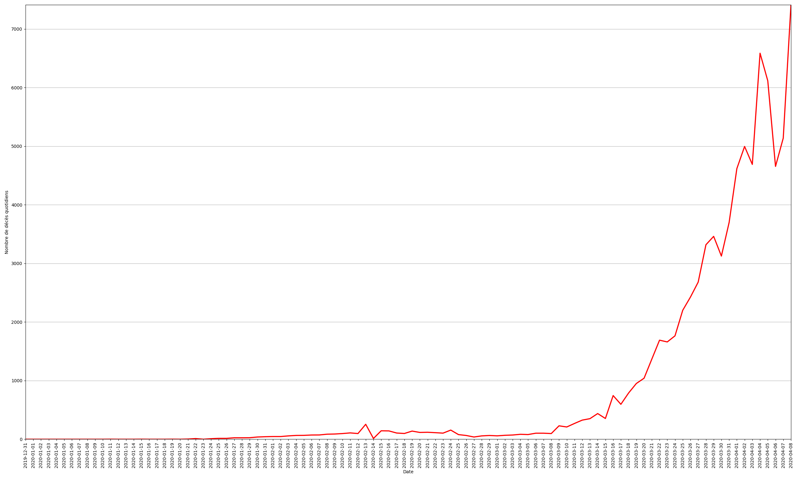
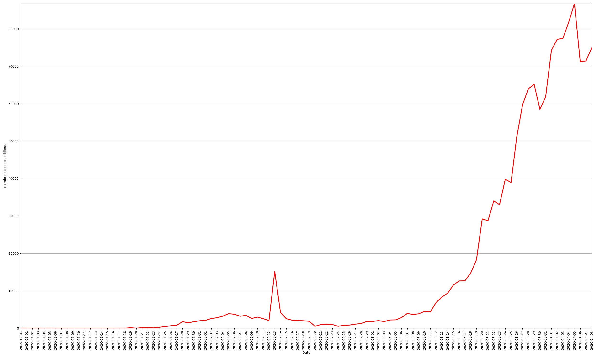
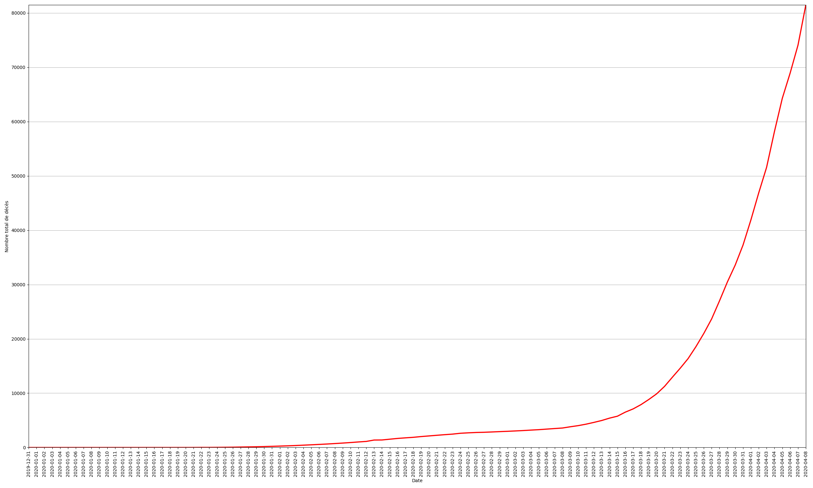
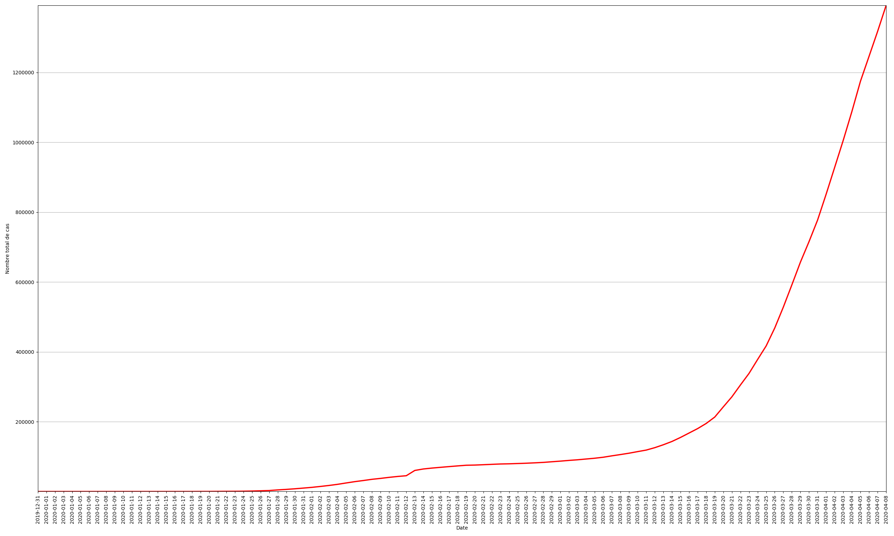
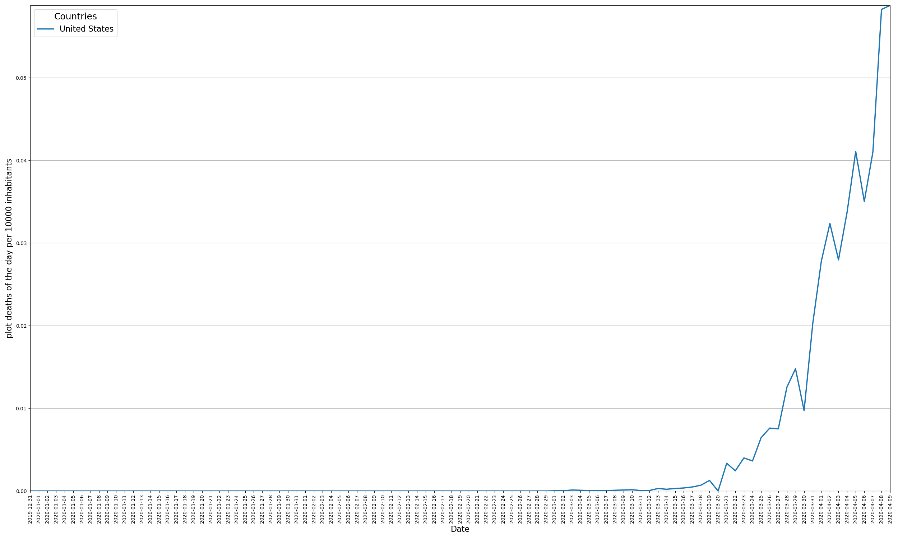

[toc]

# Installation

Cloner ce dépôt et disposer de Python3.
S'assurer de disposer des librairies du [`requirements.txt`](requirements.txt). `pip install -r requirements.txt` pour tout installer.

# Lancement

`python3 run.py [COMMANDE] [OPTIONS] [OUTPUT_FOLDER]`

`python3 run.py --help` pour voir les commandes disponibles.

# Commandes

## `map`

`map` permet de générer des cartes Leaflet (JavaScript) selon les données voulues. On peut également associer à chaque pays un graphique avec les données souhaitées. Le début de ces graphiques (Jour 0) est définissable par l'utilisateur.

Pour la carte et les graphiques, les jeux de données disponibles sont:

* cases_of_the_day
* deaths_of_the_day
* total_cases
* total_deaths

Les options suivantes sont disponibles pour `map`:

* `-mtd`, `--map_total_deaths` : Create a Leaflet layer with the cumulative deaths data
* `-mtc`, `--map_total_cases` : Create a Leaflet layer with the cumulative cases data
* `-mdd`, `--map_deaths_of_the_day` : Create a Leaflet layer with the deaths_of_the_day data
* `-mcd`, `--map_cases_of_the_day` : Create a Leaflet layer with the cases_of_the_day data
* `-ptd`, `--plot_total_deaths` : Create a Vega plot with the cumulative deaths data
* `-ptc`, `--plot_total_cases` : Create a Vega plot with the cumulative cases data
* `-pdd`, `--plot_deaths_of_the_day` : Create a Vega plot with the deaths_of_the_day data
* `-pcd`, `--plot_cases_of_the_day` : Create a Vega plot with the cases_of_the_day data
* `-pmin`, `--plot_min` : Define the value of the minimal value to process in the Vega plots
* `-h`, `--help` : Show this message and exit.

Les possibilités étant nombreuses, voici quelques exemples:

* `python3 run.py map -mtd -ptd -pmin 5` 
* `python3 run.py map -mcd -ptc -pmin 100` 

## `csv_country`

`csv_country` permet de générer des fichiers CSV pour un plusieurs pays avec les informations suivantes:

* date 
* country
* cases_of_the_day
* deaths_of_the_day
* total_cases
* total_deaths

Pour spécifier le(s) pays dont on souhaite les données depuis le 31 décembre 2019, utiliser les options suivantes:

* `-c`, `--country` TEXT : Execute the command for the country
* `-f`, `--full` : Execute the command for all the countries
* `-l`, `--liste` LIST : Execute the command for a list of countries
* `-h`, `--help` : Show this message and exit.

## `country`

`country` est une commande qui rassemble pour le pays donné toutes les sorties possibles. Elle permet soit de sortir toutes les sorties avec `-fo -fd`, soit de choisir la donnée d'entrée et le fichier de sortie (CSV ou graphique PNG).

Les arguments suivants sont disponibles:

* `output_folder` : indiquer le dossier où les fichiers seront crées (default='out')
* `country` : indiquer le nom du pays voulu (pas de valeur défaut)

Les options suivantes sont disponibles:

* `-td`, `--total_deaths` : Process the cumulative deaths data
* `-tc`, `--total_cases` : Process the cumulative cases data
* `-cd`, `--cases_of_the_day` : Process the cases of the day data
* `-dd`, `--deaths_of_the_day` : Process the deaths of the day data
* `-cdpi`, `--cases_of_the_day_per_10000_inhabitants` : Process the cases of the day per 10000 inhabitants
* `-ddpi`, `--deaths_of_the_day_per_10000_inhabitants` : Process the deaths of the day per 10000 inhabitants
* `-tcpi`, `--total_cases_per_10000_inhabitants` : Process the cumulative cases per 10000 inhabitants
* `-tdpi`, `--total_deaths_per_10000_inhabitants` : Process the cumulative deaths per 10000 inhabitants
* `-fd`, `--full_data` : Process all the available data
* `-c`, `--csv_o` : Create a CSV file in output
* `-p`, `--plot` : Create a PNG plot in output, with beginning and end of quarantine dates
* `-fo`, `--full_outputs` : Create CSV files and PNG plots in output
* `-h`, `--help` : Show this message and exit.

Exemples :

* `python3 run.py country dossier France -td -p` 
* `python3 run.py country dossier United\ States -cd -p` 

## `today`

`today` permet de créer un fichier CSV pour les données du jour-même selon les pays spécifiés et les données voulues. Si les données datent de la veille (car pas encore mises à jour sur le site soucre), un message s'affichera, et ces données de la veille seront utilisées. De nombreuses options sont disponibles et sont à combiner:

* `-c`, `--country` TEXT : Execute the command for the country
* `-f`, `--full` : Execute the command for all the countries
* `-l`, `--liste` LIST : Execute the command for a list of countries
* `-td`, `--total_deaths` : Process the cumulative deaths
* `-cd`, `--cases_of_the_day` : Process the cases of the day
* `-dd`, `--deaths_of_the_day` : Process the deaths of the day
* `-tc`, `--total_cases` : Process the cumulative cases
* `-cdpi`, `--cases_of_the_day_per_10000_inhabitants` : Process the cases of the day per 10000 inhabitants
* `-ddpi`, `--deaths_of_the_day_per_10000_inhabitants` : Process the deaths of the day per 10000 inhabitants
* `-tcpi`, `--total_cases_per_10000_inhabitants` : Process the cumulative cases per 10000 inhabitants
* `-tdpi`, `--total_deaths_per_10000_inhabitants` : Process the cumulative deaths per 10000 inhabitants
* `-h`, `--help` : Show this message and exit.

Voici un tableau récapitulatif des résultats qu'il est possible d'obtenir (données d'exemple):

|Options|`-c`|`-f`|`-l`|
|:-:|:-:|:-:|:-:|
|`-td`|country,total_deaths France,7560|country,total_deaths France,7560 Italy,15362 ...|country,total_deaths France,7560 Italy,15362|
|`-cd`|country,cases_of_the_day France,4267|country,cases_of_the_day France,4267 Italy,4805 ...|country,cases_of_the_day France,4267 Italy,4805|
|`-dd`|country,deaths_of_the_day France,1053|country,deaths_of_the_day France,1053 Italy,681 ...|country,deaths_of_the_day France,1053 Italy,681|
|`-tc`|country,total_cases France,68605|country,total_cases France,68605 Italy,124632 ...|country,total_cases France,68605 Italy,124632|
|`-td`, `-cd`,   `-dd` ou `-tc`  non spécifiés|country,cases_of_the_day,deaths_of_the_day,total_cases,total_deaths France,4267,1053,68605,7560|country,cases_of_the_day,deaths_of_the_day,total_cases,total_deaths France,4267,1053,68605,7560 Italy,4805,681,124632,15362 ...|country,cases_of_the_day,deaths_of_the_day,total_cases,total_deaths France,4267,1053,68605,7560 Italy,4805,681,124632,15362|
|`-cdpi`|country,cases_of_the_day_per_10000 France,0.02|country,cases_of_the_day_per_10000 France,0.03 Italy,0.02 ...|country,cases_of_the_day_per_10000 France,0.02 Italy,0.03|
|`-ddpi`|country,deaths_of_the_day_per_10000 France,0.02|country,deaths_of_the_day_per_10000 France,0.03 Italy,0.02 ...|country,deaths_of_the_day_per_10000 France,0.02 Italy,0.03|
|`-tcpi`|country,total_cases_per_10000 France,0.02|country,total_cases_per_10000 France,0.03 Italy,0.02 ...|country,total_cases_per_10000 France,0.02 Italy,0.03|
|`-tdpi`|country,total_deaths_per_10000 France,0.02|country,total_deaths_per_10000 France,0.03 Italy,0.02 ...|country,total_deaths_per_10000 France,0.02 Italy,0.03|

## `world`

`world` permet de traiter uniquement les données globales mondiales et d'obtenir des CSV et des graphiques selon la date souhaitée (celle du jour-même, ou jour par jour depuis le 31 décembre 2019).

De nombreuses options sont disponibles:

* `-t`, `--today`  : Process the data of today
* `-f`, `--full`: Process all the data from all the dates available
* `-cf`, `--csv_full` : Create a CSV file as output with all data
* `-cdd`, `--csv_deaths_of_the_day` : Create a CSV file as output with the deaths of the day
* `-ctd`, `--csv_total_deaths` : Create a CSV file as output with the cumulative deaths
* `-ctc`, `--csv_total_cases` : Create a CSV file as output with the cumulative cases
* `-ccd`, `--csv_cases_of_the_day` : Create a CSV file as output with the cases of the day
* `-ccdpi`, `csv_cases_of_the_day_per_10000_inhabitants` : Create a CSV file with the data of the cases of the day per 10000 inhabitants
* `-cddpi`, `csv_deaths_of_the_day_per_10000_inhabitants` : Create a CSV file with the data of the deaths of the day per 10000 inhabitants
* `-ctcpi`, `csv_total_cases_per_10000_inhabitants` : Create a CSV file with the data of the cumulative cases per 10000 inhabitants
* `-ctdpi`, `csv_total_deaths_per_10000_inhabitants` : Create a CSV file with the data of the cumulative deaths per 10000 inhabitants
* `-pf`, `--plot_full` : Create all the 4 plots available
* `-pdd`, `--plot_deaths_of_the_day` : Create a PNG plot from the deaths of the day
* `-pcd`, `--plot_cases_of_the_day` : Create a PNG plot from the cases of the day
* `-ptd`, `--plot_total_deaths` : Create a PNG plot from the cumulative deaths
* `-ptc`, `--plot_total_cases` : Create a PNG plot from the cumulative cases
* `-pcdpi`, `plot_cases_of_the_day_per_10000_inhabitants` : Create a PNG plot with the data of the cases of the day per 10000 inhabitants
* `-pddpi`, `plot_deaths_of_the_day_per_10000_inhabitants` : Create a PNG plot with the data of the deaths of the day per 10000 inhabitants
* `-ptcpi`, `plot_total_cases_per_10000_inhabitants` : Create a PNG plot with the data of the cumulative cases per 10000 inhabitants
* `-ptdpi`, `plot_total_deaths_per_10000_inhabitants` : Create a PNG plot with the data of the cumulative deaths per 10000 inhabitants
* `-h`, `--help` : Show this message and exit.

Voici un tableau récapitulatif des résultats qu'il est possible d'obtenir en CSV (données d'exemple):

|Options|`-t`|`-f`|
|:-:|:-:|:-:|
|`-cf`|date_today, cases_of_the_day, deaths_of_the_day, total_cases, total_deaths   2020-04-06, 10000, 5000, 100000, 50000|for_each_date, cases_of_the_day, deaths_of_the_day, total_cases, total_deaths   2019-12-31, 0, 0, 0, 0   ...   2020-04-05, 9000, 4000, 90000, 40000   2020-04-06, 10000, 5000, 100000, 50000|
|`-cdd`|date_today, deaths_of_the_day   2020-04-06, 5000|for_each_date, deaths_of_the_day   2019-12-31, 0   ...   2020-04-05, 4000  2020-04-06, 5000|
|`-ctd`|date_today, total_deaths   2020-04-06, 50000|for_each_date, total_deaths   2020-12-31, 0   ...   2020-04-05, 40000   2020-04-06, 50000|
|`-ctc`|date_today, total_cases   2020-04-06, 100000|for_each_date, total_cases   2020-12-31, 0   ...   2020-04-05, 90000   2020-04-06, 100000|
|`-ccd`|date_today, cases_of_the_day   2020-04-06, 10000|for_each_date, cases_of_the_day   2020-12-31, 0   ...   2020-04-05, 9000   2020-04-06, 10000|
|`-ccdpi`|date_today, cases_of_the_day_per_10000   2020-04-06, 0.01|for_each_date, cases_of_the_day_per_10000   2020-12-31, 00.01   ...   2020-04-05, 0.02   2020-04-06, 0.03|
|`-cddpi`|date_today, deaths_of_the_day_per_10000   2020-04-06, 0.01|for_each_date, deaths_of_the_day_per_10000   2020-12-31, 00.01   ...   2020-04-05, 0.02   2020-04-06, 0.03|
|`-ctcpi`|date_today, total_cases_per_10000   2020-04-06, 0.01|for_each_date, total_cases_per_10000   2020-12-31, 00.01   ...   2020-04-05, 0.02   2020-04-06, 0.03|
|`-ctdpi`|date_today, total_deaths_per_10000   2020-04-06, 0.01|for_each_date, total_deaths_per_10000   2020-12-31, 00.01   ...   2020-04-05, 0.02   2020-04-06, 0.03|
|`-pdd`|inutile||
|`-pcd`|inutile||
|`-ptd`|inutile||
|`-ptc`|inutile||
|`-pcdpi`|inutile||
|`-pddpi`|inutile||
|`-ptcpi`|inutile||
|`-ptdpi`|inutile||

## `plot`

`plot` permet de générer des graphiques en fonction des pays, un pays par graphique, ou plusieurs pays par graphique, en fonction d'un indicateur parmi les suivants:

* cases_of_the_day
* deaths_of_the_day
* total_cases
* total_deaths
* cases_of_the_day_per_10000
* deaths_of_the_day_per_10000
* total_cases_per_10000
* total_deaths_per_10000

Plusieurs options sont disponibles:

* `-c`, `--country` TEXT : Execute the command for the country
* `-f`, `--full` : Execute the command for all the countries
* `-l`, `--liste` LIST : Execute the command for a list of countries
* `-ptd`, `--plot_total_deaths` : Create a PNG plot with the data of cumulative deaths of the given country(ies)
* `-pdd`, `--plot_deaths_of_the_day` : Create a PNG plot with the data of the deaths of the day of the given country(ies)
* `-ptc`, `--plot_total_cases` : Create a PNG plot with the data of cumulative cases of the given country(ies)
* `-pcd`, `--plot_cases_of_the_day` : Create a PNG plot with the data of the cases of the day of the given country(ies)
* `-pcdpi`, `plot_cases_of_the_day_per_10000_inhabitants` : Create a PNG plot with the data of the cases of the day per 10000 inhabitants of the given country(ies)
* `-pddpi`, `plot_deaths_of_the_day_per_10000_inhabitants` : Create a PNG plot with the data of the deaths of the day per 10000 inhabitants of the given country(ies)
* `-ptcpi`, `plot_total_cases_per_10000_inhabitants` : Create a PNG plot with the data of the cumulative cases per 10000 inhabitants of the given country(ies)
* `-ptdpi`, `plot_total_deaths_per_10000_inhabitants` : Create a PNG plot with the data of the cumulative deaths per 10000 inhabitants of the given country(ies)
* `-h`, `--help` : Show this message and exit.

Exemples:

* `python3 run.py plot -pddpi -c United\ States` 